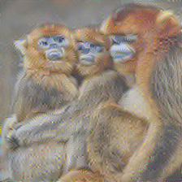

# image_invert
Image invert : 'Understanding Deep Image Representations by Inverting Them'

A simple implementation of 'Understanding Deep Image Representations by Inverting Them' , to see what it does!
  - Omitted 'natural image prior of training dataset' ( means that did not used 'sigma' in the paper )
  - Only L2 and Total Variation losses are used. 

Download vgg19 pre-trained :  http://www.vlfeat.org/matconvnet/models/beta16/imagenet-vgg-verydeep-19.mat   
   

vgg.py is borrowed from 'https://github.com/anishathalye/neural-style'

Test results from 'conv5_1' : 

< Input Image > 

 

< L2 Loss only >

 

< L2 and TV loss >

 

